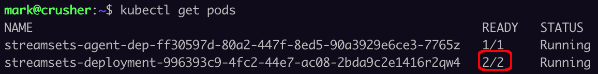
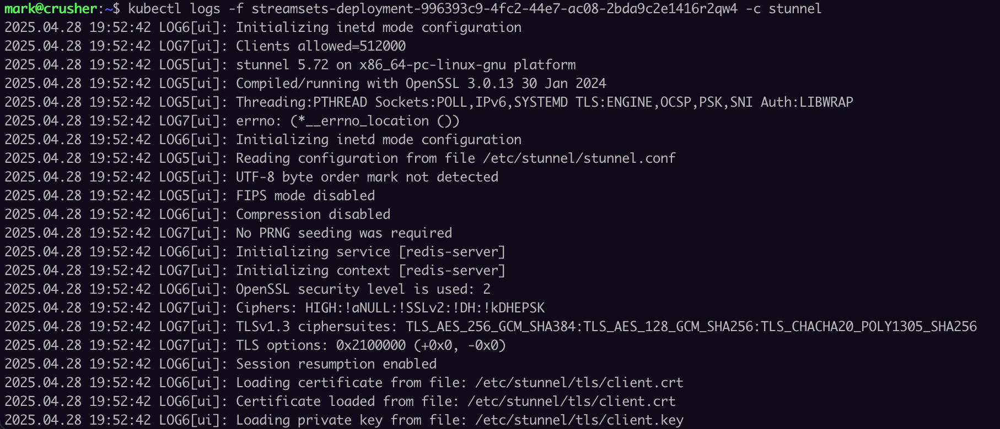

# streamsets-redis-tls
This project provides an example of how to add TLS support for [Redis](https://redis.io/) within [IBM StreamSets](https://www.ibm.com/products/streamsets) using [stunnel](https://www.stunnel.org/). 

This workaround won't be necessary once StreamSets Engine v6.3 ships with native TLS suport for Redis. In the meantime, this example may come in handy, and also serves as an example of how to deploy [sidecar containers](https://kubernetes.io/docs/concepts/workloads/pods/sidecar-containers/) alongside StreamSets engines when deploying on Kubernetes.

Stunnel is a proxy that adds TLS encryption support for unencrypted clients. There are many examples online of using stunnel with Redis, such as [this one](https://redis.io/blog/stunnel-secure-redis-ssl/)  and [this one](https://www.digitalocean.com/community/tutorials/how-to-connect-to-managed-redis-over-tls-with-stunnel-and-redis-cli). With stunnel in place, StreamSets' Redis connectors connect to a stunnel server which handles interaction with the backend Redis server using TLS..  

### Deployment Options
For standalone StreamSets deployments, one can simply install stunnel on any available machine (including, for example, the same machine the StreamSets engine is on).

For Kubernetes-based deployments, one can deploy stunnel as a sidecar container alongside a StreamSets engine.  This is the approach described in this example.

### Step 1 - Create and publish a stunnel Docker image
Create and publish a Docker container with stunnel installed.  An example Dockerfile is [here](docker/Dockerfile).

### Step 2 - Create a stunnel conf file.
An example <code>stunnel.conf</code> file template is [here](stunnel-conf/stunnel.conf). 

Here is the <code>stunnel.conf</code> file I used in my environment, with Redis running on the host <code>crusher.onefoursix.com</code> with a TLS port of <code>6380</code>. Stunnel is configured to accept calls from StreamSets on port <code>6379</code>. I did not set a <code>CAfile</code> in my config because my Redis server has a cert signed by a well-known CA, and I included a client cert and key trusted by Redis for mTLS.  Note that the config includes <code>foreground = yes</code> as the stunnel process serves as the Docker entrypoint:.

```
# stunnel.conf
debug = 7
output = /var/log/stunnel4/stunnel.log
foreground = yes

pid = /var/run/stunnel4/redis-server.pid
setuid = stunnel4
setgid = stunnel4

[redis-server]
client = yes
accept = 6379
connect = crusher.onefoursix.com:6380
cert = /etc/stunnel/tls/client.crt
key = /etc/stunnel/tls/client.key
```


### Step 3 - Save the <code>stunnel.conf</code> file in a ConfigMap.
Execute a command like this to save the <code>stunnel.conf</code> file in a ConfigMap:

```$ kubectl create configmap stunnel-config --from-file=stunnel.conf=./stunnel.conf```

### Step 4 - If mTLS is required, create a client cert and key and store them in a secret.
If mTLS is required, create or obtain a client cert and key that stunnel will use to authenticate to Redis.


Execute a command like this to save the client cert and key in a Secret:


```
$ kubectl create secret generic client-certs \
 --from-file=client.crt \
 --from-file=client.key
```

### Step 5 - Create a StreamSets Kubernetes Deployment with a stunnel sidecar container
Create a StreamSets [Kubernetes Deployment](https://www.ibm.com/docs/en/streamsets-controlhub?topic=deployments-kubernetes) and set the Advanced Mode checkbox in the Kubernetes Deployment config so you can edit the deployment's yaml directly.  Download the generated yaml and make the following changes in a developer-friendly text editor.  You can refer to a complete example yaml [here](yaml/streamsets-redis-tls-deployment.yaml).

- Add a stunnel container to the manifest as a peer to the StreamSets engine container.  The stunnel container should reference your stunnel image and include VolumeMounts for the stunnel config file from the ConfigMap and the client TLS cert and key from the Secret.  Here is a snippet of my stunnel container entry:

```
        - name: stunnel
          image: onefoursix/stunnel:1.0
          volumeMounts:
            - name: stunnel-config
              mountPath: /etc/stunnel/stunnel.conf
              subPath: stunnel.conf
            - name: client-certs
              mountPath: /etc/stunnel/tls
          ports:
            - containerPort: 6379
```

- Add Volumes for the ConfigMap and Secret:

```
      volumes:
        - name: stunnel-config
          configMap:
            name: stunnel-config
        - name: client-certs
          secret:
            secretName: client-certs
            items:
            - key: client.crt
              path: client.crt
            - key: client.key
              path: client.key
```

- Add this line so DNS is correctly resolved:

```
      dnsPolicy: ClusterFirst
```

Once again, refer to the example yaml [here](yaml/streamsets-redis-tls-deployment.yaml).

Import the edited deployment yaml back into the StreamSets Deployment UI and save the deployment.


### Step 6 - Start the Deployment
Start the deployment, and if all goes well you should see two containers are running in your engine pod, like this:



If both containers come up, you should be able to tail the log of the stunnel container using a command like this:

```
      $ kubectl logs -f streamsets-deployment-<pod id> -c stunnel
```




